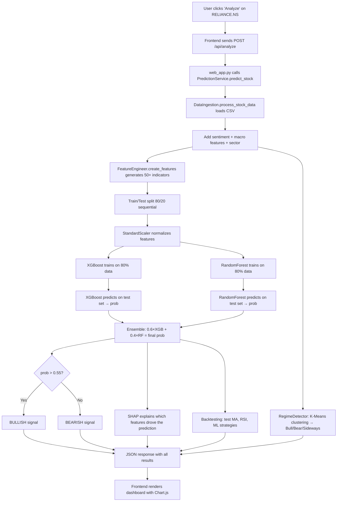

# 📊 NIFTY 50 Stock Prediction System — Complete Deep Dive

> **Purpose**: This document explains **every technical and financial concept** used in this project, how each model works, what each CSV column does, and exactly how the system decides whether a stock is **BULLISH** or **BEARISH**.

---

## Table of Contents

1. [Project Overview](#1-project-overview)
2. [Data Pipeline — What Goes In](#2-data-pipeline--what-goes-in)
3. [CSV Column Reference — What Each Column Does](#3-csv-column-reference--what-each-column-does)
4. [Financial Indicators Explained](#4-financial-indicators-explained)
5. [Feature Engineering — From Raw Prices to ML Inputs](#5-feature-engineering--from-raw-prices-to-ml-inputs)
6. [The ML Models — How Predictions Are Made](#6-the-ml-models--how-predictions-are-made)
7. [BULLISH vs BEARISH — The Decision Logic](#7-bullish-vs-bearish--the-decision-logic)
8. [SHAP Explainability — Why the Model Decided That Way](#8-shap-explainability--why-the-model-decided-that-way)
9. [Backtesting — Testing Strategies on Historical Data](#9-backtesting--testing-strategies-on-historical-data)
10. [Regime Detection — Reading Market Mood](#10-regime-detection--reading-market-mood)
11. [The Screener — Scanning All Stocks at Once](#11-the-screener--scanning-all-stocks-at-once)
12. [Sector Analysis](#12-sector-analysis)
13. [Module-by-Module Breakdown](#13-module-by-module-breakdown)
14. [End-to-End Flow — Full Prediction Lifecycle](#14-end-to-end-flow--full-prediction-lifecycle)

---

## 1. Project Overview

This is a **stock direction prediction system** for the **NIFTY 50** — the 50 largest publicly-traded companies on India's National Stock Exchange (NSE).

### What it does:
- Takes **historical OHLCV data** (Open, High, Low, Close, Volume) for any NIFTY 50 stock
- Engineers **50+ technical features** from the raw prices
- Trains an **XGBoost + Random Forest ensemble** classifier
- Outputs a **BULLISH or BEARISH** signal with a confidence score
- Explains **why** using SHAP feature importance
- **Backtests** trading strategies on historical data
- Detects the current **market regime** (Bull / Bear / Sideways)
- **Screens** all 50 stocks at once for quick comparison

### What it does NOT do:
- It does **not** predict exact prices
- It does **not** trade automatically
- It is a **decision-support tool**, not financial advice

---

## 2. Data Pipeline — What Goes In

### Data Sources (Priority Order)

| Priority | Source | Description |
|----------|--------|-------------|
| 1st | **Local CSV files** in `data/external_nifty50/` | Pre-downloaded NIFTY 50 stock data (~47 CSV files) |
| 2nd | **Project dataset directory** (`ML/dataset/`) | Chunked multi-symbol CSV files (if available) |
| 3rd | **Yahoo Finance API** (via `yfinance`) | Live data fetched from the internet as fallback |

### How Data Flows

```
CSV Files / Yahoo Finance
        ↓
  DataIngestion.process_stock_data(ticker)
        ↓
  Normalize columns → Clean OHLCV → Add sentiment → Add macro features → Add sector
        ↓
  Raw DataFrame with columns:
    date, open, high, low, close, volume, adj close,
    sentiment, interest_rate, inflation_rate, usd_inr, global_vix, sector
```

### Synthetic/Generated Features

Since this is an educational project, some features are **generated synthetically** rather than pulled from real APIs:

| Feature | How It's Generated | Real-World Alternative |
|---------|-------------------|----------------------|
| **Sentiment** | Momentum ÷ Volatility, smoothed over 5 days | FinBERT on financial news |
| **Interest Rate** | Sinusoidal wave centered at 6.5% | RBI policy rate API |
| **Inflation Rate** | Cosine wave centered at 5.5% | RBI/Government CPI data |
| **USD/INR** | Random walk starting at ₹82 | Forex API |
| **Global VIX** | Random walk starting at 15 | CBOE VIX Index |

---

## 3. CSV Column Reference — What Each Column Does

### Raw Input Columns (from CSV files)

| Column | What It Means | Example |
|--------|--------------|---------|
| **Date** | Trading date | `2025-04-01` |
| **Open** | Price when stock market opened that day | ₹2,847.50 |
| **High** | Highest price reached during the trading day | ₹2,892.00 |
| **Low** | Lowest price during the trading day | ₹2,831.25 |
| **Close** | Price at market close (most important!) | ₹2,876.40 |
| **Volume** | Number of shares traded that day | 12,345,678 |
| **Adj Close** | Close price adjusted for dividends and stock splits | ₹2,870.15 |

### Why Each Column Matters

- **Close**: This is the primary column. Almost every indicator (RSI, MACD, moving averages) is computed from close prices. The prediction **target** is also based on whether close prices go up.
- **High / Low**: Used for volatility measures (ATR, Bollinger Bands, Stochastic Oscillator). A wide High-Low spread means high volatility.
- **Open**: Used for price pattern detection. `close > open` means bullish candle, `close < open` means bearish candle.
- **Volume**: Confirms price moves. High volume + price increase = strong bullish signal. Low volume + price increase = weak, potentially fake rally.
- **Adj Close**: Used as a backup for Close when dividends distort raw close prices.

---

## 4. Financial Indicators Explained

These are the "financial derivatives" — mathematical formulas computed FROM the raw price data. Each indicator measures a different property of price behavior.

### 4.1 RSI (Relative Strength Index)

**File**: `feature_engineering.py`, `calculate_rsi()`  
**Input**: Close prices  
**Period**: 14 days (also 7 days)  
**Range**: 0 to 100

**What it measures**: How much buying vs. selling pressure exists.

**Formula**:
```
Daily Change = Today's Close - Yesterday's Close
Average Gain = Mean of positive changes over 14 days
Average Loss = Mean of negative changes over 14 days

RS  = Average Gain / Average Loss
RSI = 100 - (100 / (1 + RS))
```

**How to read it**:
| RSI Range | Interpretation |
|-----------|---------------|
| > 70 | **Overbought** — stock has risen too fast, expect pullback |
| 30-70 | **Neutral** — no extreme detected |
| < 30 | **Oversold** — stock has fallen too fast, expect recovery |

**Impact on prediction**: RSI contributes a bullish signal when oversold (good buying opportunity) and bearish when overbought.

---

### 4.2 MACD (Moving Average Convergence Divergence)

**File**: `feature_engineering.py`, `calculate_macd()`  
**Input**: Close prices  
**Components**: 3 values (MACD Line, Signal Line, Histogram)

**What it measures**: The difference between short-term and long-term momentum.

**Formula**:
```
Fast EMA  = 12-day Exponential Moving Average
Slow EMA  = 26-day Exponential Moving Average

MACD Line    = Fast EMA - Slow EMA
Signal Line  = 9-day EMA of MACD Line
Histogram    = MACD Line - Signal Line
```

**How to read it**:
| Signal | Meaning |
|--------|---------|
| MACD crosses ABOVE signal line | **Bullish crossover** — buying momentum increasing |
| MACD crosses BELOW signal line | **Bearish crossover** — selling momentum increasing |
| Histogram > 0 | Momentum is bullish |
| Histogram < 0 | Momentum is bearish |

**Impact on prediction**: The MACD histogram is one of the strongest features for the model. Positive histogram → bullish. Negative → bearish.

---

### 4.3 Bollinger Bands

**File**: `feature_engineering.py`, `calculate_bollinger_bands()`  
**Input**: Close prices  
**Period**: 20 days, ±2 standard deviations

**What they measure**: Whether the current price is "normal" or at an extreme.

**Formula**:
```
Middle Band = 20-day Simple Moving Average (SMA)
Upper Band  = Middle + (2 × 20-day Standard Deviation)
Lower Band  = Middle - (2 × 20-day Standard Deviation)

BB Width = (Upper - Lower) / Middle
BB %B    = (Close - Lower) / (Upper - Lower)
```

**How to read them**:
| Position | Meaning |
|----------|---------|
| Price near upper band (%B > 0.8) | Potentially overbought |
| Price near lower band (%B < 0.2) | Potentially oversold |
| Bands widening | Volatility is increasing |
| Bands narrowing | Volatility is compressing (breakout coming) |

---

### 4.4 ATR (Average True Range)

**File**: `feature_engineering.py`, `calculate_atr()`  
**Input**: High, Low, Close prices  
**Period**: 14 days

**What it measures**: Pure volatility — how much the stock price moves per day.

**Formula**:
```
True Range = MAX(
   High - Low,
   |High - Previous Close|,
   |Low  - Previous Close|
)
ATR = 14-day rolling average of True Range

ATR% = ATR / Close  (normalized volatility)
```

**How to read it**: Higher ATR = more volatile stock. The model uses ATR% (ATR as a percentage of price) so it's comparable across different stock prices.

---

### 4.5 OBV (On-Balance Volume)

**File**: `feature_engineering.py`, `calculate_obv()`  
**Input**: Close, Volume

**What it measures**: Whether volume is flowing INTO or OUT OF a stock.

**Formula**:
```
If today's close > yesterday's close: OBV += today's volume
If today's close < yesterday's close: OBV -= today's volume
If unchanged: OBV stays the same
```

**How to read it**: Rising OBV + rising price = healthy uptrend. Rising price but falling OBV = suspicious (smart money selling).

---

### 4.6 ADX (Average Directional Index)

**File**: `feature_engineering.py`, `calculate_adx()`  
**Input**: High, Low, Close  
**Period**: 14 days

**What it measures**: How STRONG the current trend is (not direction, just strength).

| ADX Value | Trend Strength |
|-----------|---------------|
| 0-20 | Weak/No trend |
| 20-40 | Moderate trend |
| 40-60 | Strong trend |
| 60+ | Very strong trend |

---

### 4.7 Stochastic Oscillator

**File**: `feature_engineering.py`, `calculate_stochastic()`  
**Input**: High, Low, Close  
**Period**: 14 days

**What it measures**: Where the close price sits within the recent high-low range.

**Formula**:
```
%K = 100 × (Close - Lowest Low over 14d) / (Highest High - Lowest Low)
%D = 3-day SMA of %K
```

| Value | Meaning |
|-------|---------|
| %K > 80 | Overbought |
| %K < 20 | Oversold |
| %K crosses above %D | Buy signal |

---

### 4.8 Moving Averages (SMA and EMA)

**What they measure**: Smoothed price trend over different time periods.

| Feature | Formula | Purpose |
|---------|---------|---------|
| SMA 5 | 5-day simple average | Ultra-short trend |
| SMA 10 | 10-day simple average | Short trend |
| SMA 20 | 20-day simple average | Medium trend |
| SMA 50 | 50-day simple average | Long trend |
| EMA 9 | 9-day exponential average | Fast momentum |
| EMA 12/26 | Used in MACD | Trend direction |

**Key signal**: When SMA 20 crosses ABOVE SMA 50, it's a **Golden Cross** (bullish). When it crosses BELOW, it's a **Death Cross** (bearish). This is captured in the `sma_crossover` feature (1 or 0).

---

### 4.9 ROC (Rate of Change)

**File**: `feature_engineering.py`, `calculate_roc()`

**Formula**: `ROC = ((Price today / Price N days ago) - 1) × 100`

Measures how fast the price is changing in percentage terms over 5 and 10 days.

---

## 5. Feature Engineering — From Raw Prices to ML Inputs

The `FeatureEngineer.create_features()` method transforms raw OHLCV data into **50+ numerical features** that the ML model can understand:

### Feature Categories

| Category | Count | Features | What They Capture |
|----------|-------|----------|-------------------|
| **Returns** | 4 | `daily_return`, `5day_return`, `10day_return`, `20day_return` | Price momentum over different windows |
| **Volatility** | 2 | `volatility_20`, `volatility_60` | Risk / uncertainty |
| **Moving Averages** | 10 | `sma_5`, `sma_10`, `sma_20`, `sma_50`, `ema_9/12/21/26`, `sma_crossover`, `price_sma_ratios` | Trend direction |
| **RSI** | 2 | `rsi_14`, `rsi_7` | Overbought / oversold |
| **MACD** | 3 | `macd`, `macd_signal`, `macd_histogram` | Momentum crossovers |
| **Stochastic** | 2 | `stochastic_k`, `stochastic_d` | Price position in range |
| **Bollinger Bands** | 6 | `bb_upper/middle/lower`, `bb_width`, `bb_position`, `bollinger_pct_b` | Volatility bands |
| **ATR/ADX** | 3 | `atr_14`, `atr_pct`, `adx_14` | Volatility & trend strength |
| **OBV** | 3 | `obv`, `obv_ema`, `obv_change_5d` | Volume pressure |
| **Volume** | 2 | `volume_sma_20`, `volume_ratio` | Volume confirmation |
| **Price Action** | 4 | `high_low_ratio`, `close_open_ratio`, `price_range`, `price_position` | Candle patterns |
| **Lagged** | 12 | `close_lag_1/5/10/20`, `return_lag_1/5/10/20`, `volume_lag_1/5/10/20` | Past values for time-series patterns |
| **Sentiment** | 1 | `sentiment` | Market mood proxy |
| **Macro** | 4 | `interest_rate`, `inflation_rate`, `usd_inr`, `global_vix` | Economic environment |
| **ROC** | 2 | `roc_5`, `roc_10` | Rate of price change |

### The Target Variable

```python
future_return_5d = log(close_in_5_days / close_today)
target_5d = 1 if future_return_5d > 1.5% else 0
```

This means: **"Will this stock's price be at least 1.5% higher in 5 trading days?"**

- `target_5d = 1` → YES → The model should learn **BULLISH** features
- `target_5d = 0` → NO → The model should learn **BEARISH** features

---

## 6. The ML Models — How Predictions Are Made

### 6.1 XGBoost Classifier (Primary Model, 60% weight)

**Library**: `xgboost.XGBClassifier`  
**Type**: Gradient-boosted decision tree ensemble

**How it works**:
1. Starts with a base prediction
2. Builds **150 decision trees**, each one correcting the errors of the previous ones
3. Each tree asks questions like "Is RSI > 70?" → "Is MACD histogram < 0?" → predict bearish
4. All trees vote together for the final probability

**Hyperparameters used**:
| Parameter | Value | Purpose |
|-----------|-------|---------|
| `n_estimators` | 150 | Number of trees |
| `max_depth` | 4 | How deep each tree can go (limits overfitting) |
| `learning_rate` | 0.05 | How much each new tree corrects (lower = more conservative) |
| `subsample` | 0.8 | Each tree only sees 80% of data (prevents overfitting) |
| `colsample_bytree` | 0.8 | Each tree only sees 80% of features |
| `reg_alpha` | 0.1 | L1 regularization (feature selection) |
| `reg_lambda` | 1.0 | L2 regularization (weight smoothing) |
| `scale_pos_weight` | auto | Compensates for imbalanced classes |
| `objective` | `binary:logistic` | Outputs probability 0.0 to 1.0 |

### 6.2 Random Forest Classifier (Secondary Model, 40% weight)

**Library**: `sklearn.ensemble.RandomForestClassifier`  
**Type**: Bagged decision tree ensemble

**How it works**:
1. Builds **300 independent decision trees** (max depth = 15) on different random subsets of data
2. Each tree votes independently
3. Final prediction = majority vote across all trees

**Key difference from XGBoost**: Trees are built independently (in parallel), not sequentially. This makes it a good complement — XGBoost captures sequential patterns, Random Forest captures broad consensus.

### 6.3 Ensemble (Final Output)

```python
Final Probability = 0.6 × XGBoost probability + 0.4 × Random Forest probability
```

The ensemble averages both models with XGBoost getting more weight (60/40) because gradient boosting generally outperforms bagging on structured/tabular data.

### 6.4 Training Process

```
Raw OHLCV Data (365 days)
    ↓
Feature Engineering (50+ features)
    ↓
Remove NaN rows
    ↓
Train/Test Split: 80% train, 20% test (sequential, NOT shuffled)
    ↓
StandardScaler: normalize features to mean=0, std=1
    ↓
Train XGBoost on scaled training data
Train Random Forest on scaled training data
    ↓
Predict on the LAST row of test data → ensemble probability
```

> [!IMPORTANT]
> The train/test split uses `shuffle=False` — this is critical for time-series data. You cannot shuffle because future data must never leak into training.

---

## 7. BULLISH vs BEARISH — The Decision Logic

### The Core Rule

```python
ensemble_probability = 0.6 * xgboost_prob + 0.4 * random_forest_prob

if ensemble_probability > 0.55:
    signal = "BULLISH"
else:
    signal = "BEARISH"

confidence = max(ensemble_probability, 1 - ensemble_probability)
```

### Why 0.55 and not 0.50?

The threshold is set at **55%** instead of the usual 50% to add a **confidence buffer**. A stock needs to have >55% bullish probability to receive a BULLISH signal. This makes the system more conservative — it only calls BULLISH when the model is reasonably sure.

### Confidence Score

The confidence is always the **distance from 50%**:
- Probability = 0.80 → Confidence = 80% (strongly bullish)
- Probability = 0.20 → Confidence = 80% (strongly bearish)
- Probability = 0.55 → Confidence = 55% (barely bullish)
- Probability = 0.50 → Confidence = 50% (coin flip — still called BEARISH by the 55% threshold)

### What Drives a BULLISH Prediction?

The model looks at combinations of features. Common patterns that lead to BULLISH:

| Feature Pattern | Why It's Bullish |
|----------------|------------------|
| RSI around 30-50 (oversold/neutral) | Stock has room to go up |
| MACD histogram turning positive | Momentum is shifting upward |
| SMA 20 > SMA 50 (golden cross) | Short-term trend is above long-term |
| High volume ratio (>1.0) | Strong buying interest |
| Low volatility regime | Stable upward movement likely |
| Positive sentiment | Market mood is optimistic |

### What Drives a BEARISH Prediction?

| Feature Pattern | Why It's Bearish |
|----------------|------------------|
| RSI > 70 (overbought) | Stock has risen too far too fast |
| MACD histogram going negative | Momentum shifting downward |
| SMA 20 < SMA 50 (death cross) | Short-term trend is below long-term |
| Widening Bollinger Bands upward | Volatility increasing at highs |
| High VIX / volatility | Fear in the market |

---

## 8. SHAP Explainability — Why the Model Decided That Way

**Library**: `shap` (SHapley Additive exPlanations)

### What SHAP Does

For every prediction, SHAP calculates **how much each feature pushed** the prediction toward bullish or bearish.

**Example**: If the model predicts 70% BULLISH for RELIANCE:
```
Base value:     50% (starting point)
RSI_14:        +8%  (RSI is oversold → pushes bullish)
MACD histogram: +7%  (positive momentum)
Volume ratio:  +3%  (high buying volume)
VIX:           -2%  (high fear → slightly bearish)
Other features: +4%
Final:          70% BULLISH
```

### How It Works Internally

SHAP uses **game theory** (Shapley values) to fairly distribute "credit" for the prediction among all features. Each feature gets a SHAP value:
- **Positive SHAP** → pushes toward BULLISH
- **Negative SHAP** → pushes toward BEARISH
- **Large absolute value** → high importance

### Fallback Mechanism

When the SHAP library has compatibility issues with the XGBoost version, the system falls back to **XGBoost native contribution values** (`pred_contribs=True`), which serve a similar purpose.

---

## 9. Backtesting — Testing Strategies on Historical Data

The system tests 4 strategies on the same historical data and compares their performance.

### Strategy 1: ML Strategy
Uses the ensemble model's predictions as trading signals.
```
If model predicts > 55% bullish → BUY (hold)
Otherwise → SELL (no position)
```

### Strategy 2: Moving Average Crossover
Classic technical analysis strategy:
```
If SMA(20) > SMA(50) → BUY
If SMA(20) ≤ SMA(50) → SELL
```

### Strategy 3: RSI Mean Reversion
Buy when oversold, sell when overbought:
```
If RSI < 30 → BUY
If RSI > 70 → SELL
Otherwise → HOLD
```

### Strategy 4: Buy & Hold (Benchmark)
Simply buy on day 1 and hold until the end. This is the baseline to beat.

### Metrics Reported

| Metric | What It Measures |
|--------|-----------------|
| **Total Return %** | How much money the strategy made/lost |
| **Annualized Return %** | Return projected to a full year |
| **Sharpe Ratio** | Risk-adjusted return (>1 is good, >2 is excellent) |
| **Max Drawdown %** | Worst peak-to-trough loss (how scary was the worst dip?) |
| **Win Rate %** | What percentage of trading days were profitable |
| **Profit Factor** | Gross profit ÷ gross loss (>1 means profitable overall) |
| **Calmar Ratio** | Return ÷ Max Drawdown (higher = better risk-adjusted return) |

### Transaction Costs
Every trade incurs a **0.1% cost** (simulating brokerage fees). This is deducted from strategy returns to make results more realistic.

---

## 10. Regime Detection — Reading Market Mood

### What is a "Market Regime"?

Markets alternate between different states:
- **Bull Market**: Prices trending upward, low volatility
- **Bear Market**: Prices trending downward, high volatility
- **Sideways Market**: No clear trend, choppy

### Method 1: K-Means Clustering

**File**: `regime_detection.py`, `RegimeDetector`

Groups trading days into 3 clusters based on:
1. **Daily returns** (is the price going up or down?)
2. **20-day volatility** (how jittery is the price?)
3. **20-day momentum** (is the trend sustained?)

K-Means finds 3 natural groupings and labels them Bear (lowest avg return), Sideways (middle), and Bull (highest avg return).

### Method 2: Volatility Regime

**File**: `regime_detection.py`, `VolatilityRegimeDetector`

Simpler rule-based:
```
20-day volatility < 1%  → "Low Volatility"
20-day volatility > 3%  → "High Volatility"
Otherwise               → "Medium Volatility"
```

---

## 11. The Screener — Scanning All Stocks at Once

### What is the Screener?

The **Stock Screener** is a tool that rapidly evaluates **all 50 NIFTY stocks** in parallel and ranks them by a composite score. Think of it as a filter that answers: *"Which stocks look most bullish right now, and which look most bearish?"*

**File**: `backend/screener.py`, `StockScreener`  
**API**: `POST /api/screener`  
**Frontend Tab**: "Screener"

### How It Works — Step by Step

```
1. Get list of all available tickers (up to 50 NIFTY stocks)
    ↓
2. Optionally filter by sector (e.g., "only IT stocks")
    ↓
3. For EACH ticker, run predict_stock_light() in parallel threads
    ↓
4. predict_stock_light() uses a FAST heuristic (no training), computing:
   - RSI, MACD, moving average trends
   - Volume ratio
   - A quick logistic probability score
    ↓
5. Filter results by:
   - Minimum confidence (default: 55%)
   - Minimum volume ratio (default: 0)
   - Regime filter (optional)
    ↓
6. Compute composite score for ranking:
   Score = 0.6 × confidence + 0.2 × (RSI/100) + 0.2 × volume_ratio
    ↓
7. Split into BULLISH and BEARISH lists, sorted by score
    ↓
8. Return top 20 from each list
```

### The Light Prediction Mode

The screener does NOT fully train models for each stock — that would take minutes. Instead, `predict_stock_light()` uses a **fast heuristic formula**:

```python
trend_signal  = (SMA_20 - SMA_50) / |SMA_50|    # Trend direction
return_5d     = 5-day price change                # Recent momentum
rsi_signal    = (RSI - 50) / 50                   # Distance from neutral RSI
vol_penalty   = -min(30d_volatility / 0.03, 2.0)  # Penalty for high volatility

score = 2.8×trend + 1.7×return_5d + 0.9×rsi + 0.6×vol_penalty

bullish_probability = 1 / (1 + exp(-score))   # Logistic sigmoid
```

This gives a quick 0-1 probability without ML model training — useful for rapid screening.

### Screener Filters

| Filter | Default | Purpose |
|--------|---------|---------|
| **Sector** | All | Limit to one sector (e.g., "IT", "Banking") |
| **Min Confidence** | 0.55 | Only show stocks the heuristic is ≥55% confident about |
| **Min Volume Ratio** | 0 | Filter for high-volume stocks (volume ratio > 1 means above-average volume) |
| **Regime Filter** | None | Only show stocks in a specific volatility regime |

### Threading & Performance

The screener runs up to **8 parallel threads** (capped at `min(8, max(4, cpu_cores×2))`). Each stock gets a **10-second timeout** per thread. A full 50-stock scan typically completes in 5-15 seconds.

### Caching

Results are cached by filter combination (`sector-confidence-volume-regime-topN`). The cache has a thread-safe lock to prevent corruption during concurrent API calls.

---

## 12. Sector Analysis

**File**: `backend/sector_analysis.py`, `SectorAnalyzer`

Takes the screener's output and aggregates it by sector:

For each sector:
- **Bullish %** = how many stocks in that sector are bullish
- **Avg Confidence** = mean confidence across sector stocks
- **Avg RSI** = mean RSI (shows if entire sector is overbought/oversold)
- **Avg 5-day Return** = sector momentum
- **Sector Score** = `0.5 × bullish% + 0.3 × confidence + 0.2 × return` — used for ranking

Sectors are ranked by sector score to show which sectors are strongest/weakest.

---

## 13. Module-by-Module Breakdown

### `backend/data_ingestion.py` (1,285 lines)
- **Purpose**: Load, clean, and normalize stock data from CSVs or Yahoo Finance
- **Key classes**: `DataIngestion`
- **Key methods**: `process_stock_data()`, `fetch_stock_data()`, `process_uploaded_file()`
- **Special features**: Multi-source priority system, uploaded file parsing (7 formats), ticker-matching via normalized names, date format auto-detection

### `backend/feature_engineering.py` (427 lines)
- **Purpose**: Transform raw OHLCV into 50+ ML features
- **Key class**: `FeatureEngineer`
- **Key method**: `create_features()` — the main pipeline
- **Also**: `get_indicator_snapshot()` returns current indicator values for the frontend

### `backend/models.py` (292 lines)
- **Purpose**: ML model wrappers
- **Classes**: `XGBoostPredictor`, `RandomForestPredictor`, `EnsemblePredictor`
- **Also**: `evaluate_predictions()` — computes accuracy, precision, recall, F1, AUC, log-loss, Brier score, confusion matrix

### `backend/predictions.py` (899 lines)
- **Purpose**: Main orchestrator — connects all modules
- **Key class**: `PredictionService`
- **Key methods**: 
  - `predict_stock()` — full pipeline with training
  - `predict_stock_light()` — fast heuristic for screener
  - `predict_from_uploaded_data()` — for user-uploaded CSV files
- **Caching**: In-memory with thread-safe RLock, bounded at 100-200 entries

### `backend/explainability.py` (497 lines)
- **Purpose**: SHAP-based prediction explanation
- **Key class**: `ModelExplainer`
- **Fallback**: When SHAP fails, uses XGBoost native `pred_contribs`
- **Also**: `RuleBasedExplainer` for human-readable technical analysis summaries

### `backend/backtesting.py` (304 lines)
- **Purpose**: Historical strategy testing
- **Key class**: `BacktestEngine`
- **Strategies**: MA crossover, RSI mean reversion, ML-based
- **Metrics**: Return, Sharpe, max drawdown, win rate, profit factor, Calmar ratio

### `backend/regime_detection.py` (303 lines)
- **Purpose**: Market state detection
- **Classes**: `RegimeDetector` (K-Means), `HiddenMarkovModelRegimeDetector` (optional HMM), `VolatilityRegimeDetector`

### `backend/screener.py` (153 lines)
- **Purpose**: Multi-stock parallel screening
- **Key class**: `StockScreener`
- **Uses**: `predict_stock_light()` for speed, `ThreadPoolExecutor` for parallelism

### `backend/sector_analysis.py` (69 lines)
- **Purpose**: Aggregate screener results by sector
- **Key class**: `SectorAnalyzer`

### `backend/utils.py` (273 lines)
- **Purpose**: Shared utilities — sector map, caching, JSON encoding, formatting

### `frontend/web_app.py` (507 lines)
- **Purpose**: FastAPI REST API + Jinja2 HTML serving
- **Endpoints**: `/api/analyze`, `/api/upload-train`, `/api/screener`, `/api/sector-analysis`, `/api/compare`, `/api/stocks`, `/api/data-health`

### `frontend/templates/index.html` (379 lines)
- **Purpose**: Bootstrap 5 dark-mode dashboard UI with 7 tabs

### `frontend/static/js/app.js` (663 lines)
- **Purpose**: Client-side JavaScript — API calls, Chart.js rendering, tab management

*(Deleted)* `frontend/app.py` — the legacy Streamlit dashboard was removed during cleanup since `streamlit` was not in `requirements.txt` and it could not run. `web_app.py` is the sole frontend.

---

## 14. End-to-End Flow — Full Prediction Lifecycle



---

> [!NOTE]
> This is a **decision-support tool for educational use**. It should never be used as the sole basis for investment decisions. Past performance and backtesting results do not guarantee future performance. Always consult licensed financial advisors before trading.
