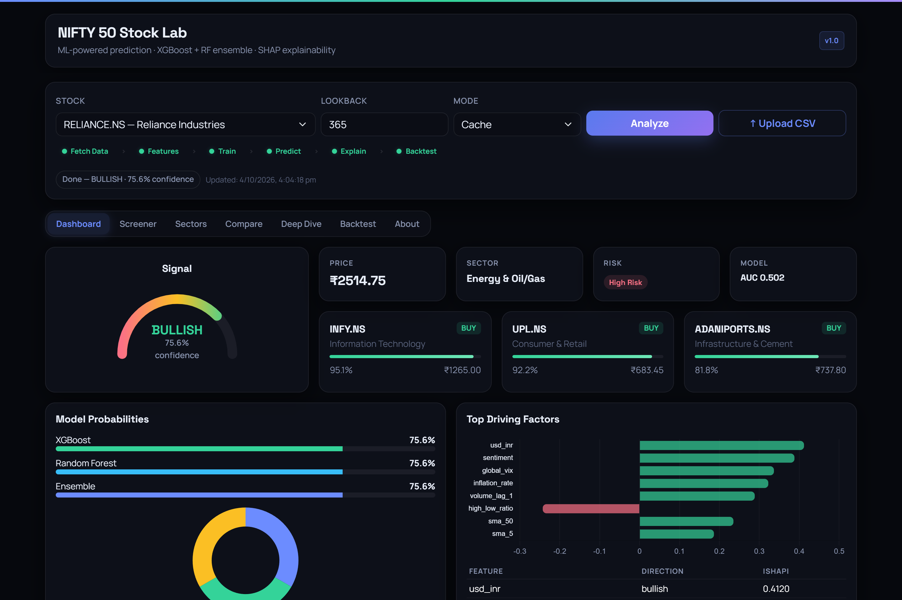
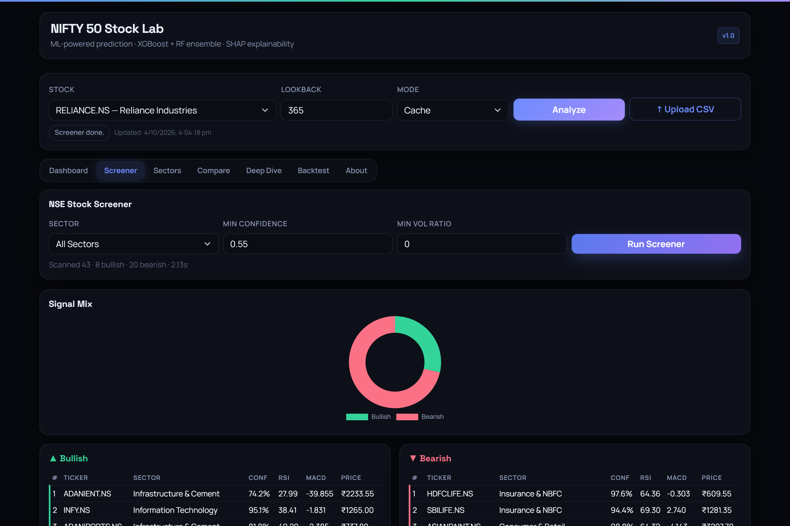
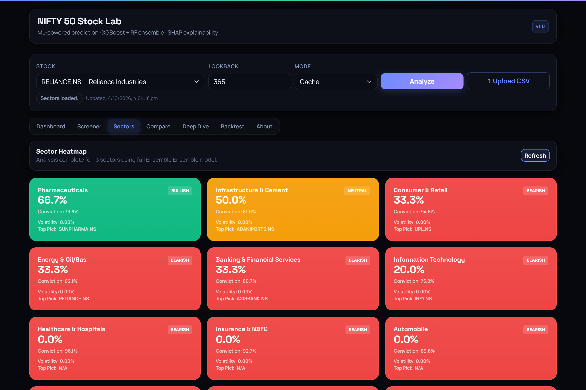
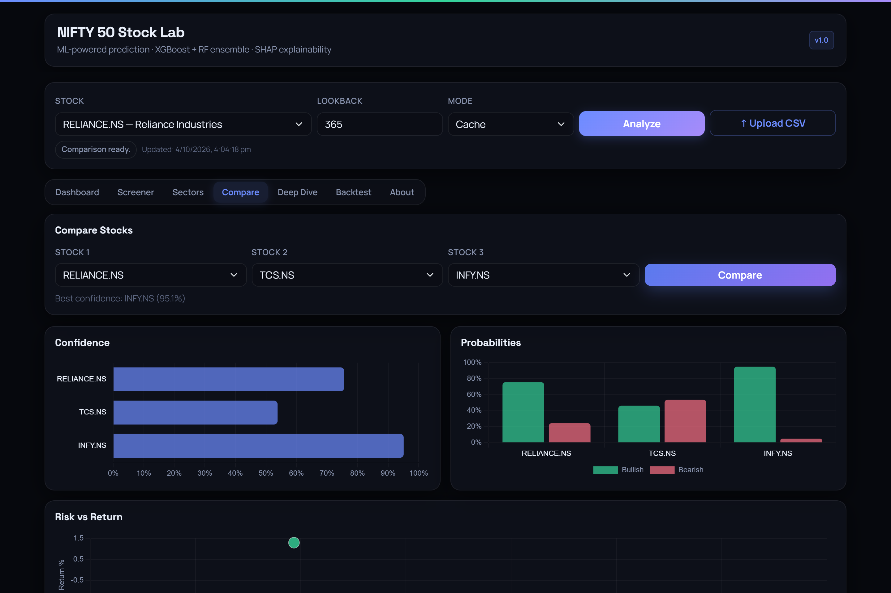
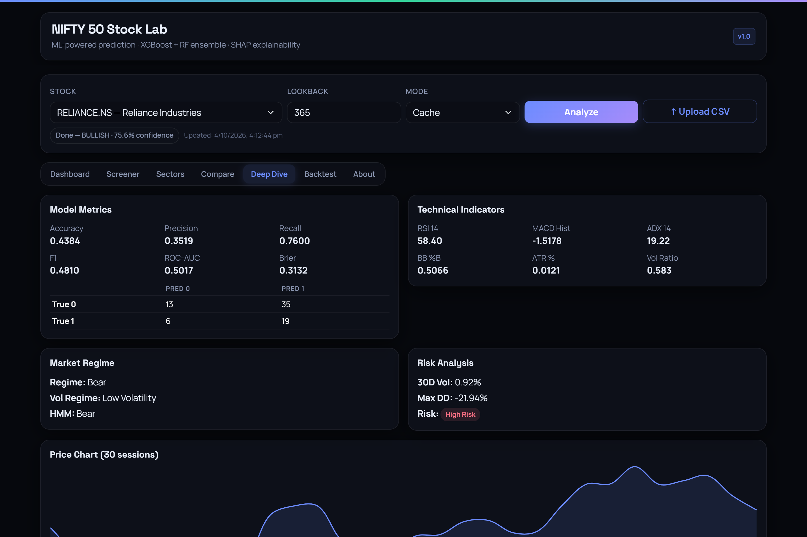
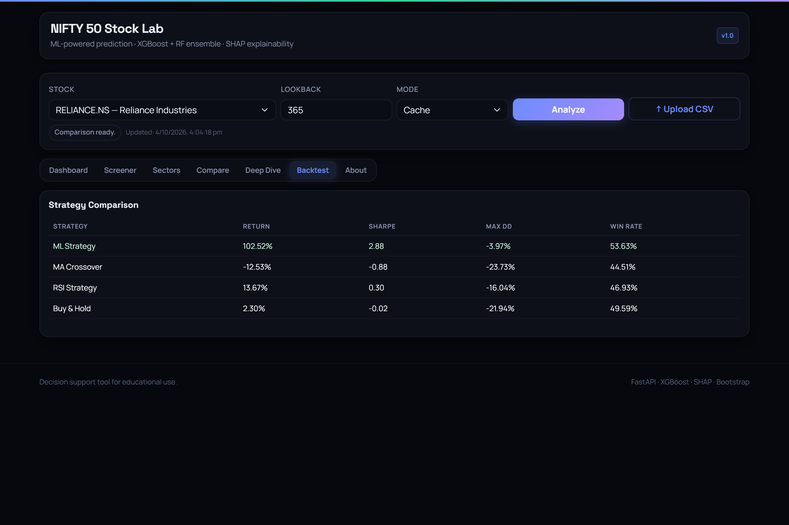
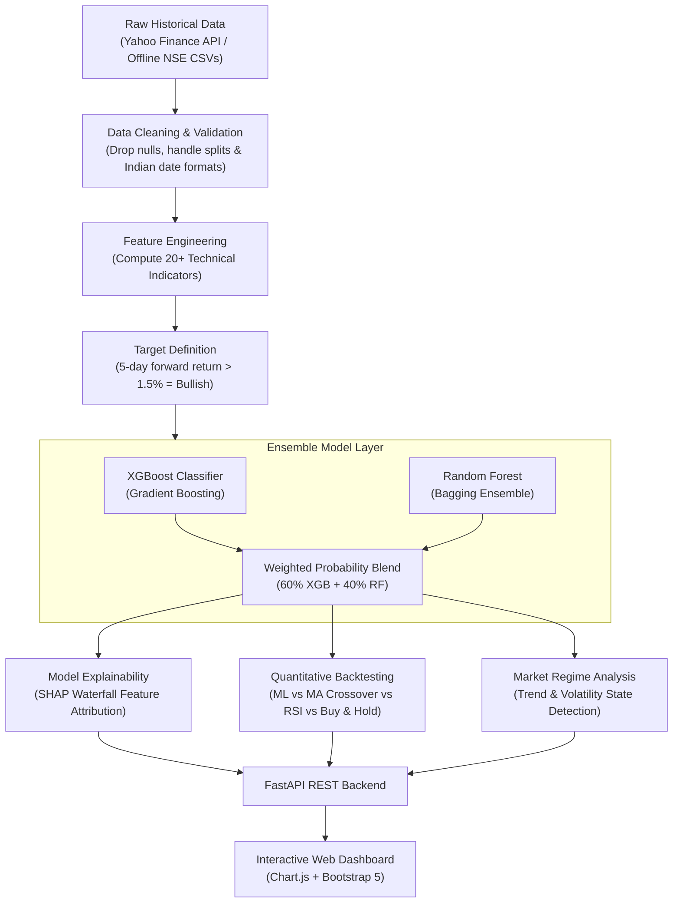

# 📈 NIFTY 50 Stock Prediction & Market Analysis System
> **Computer Engineering Project** · Machine Learning & Quantitative Finance

[](https://www.python.org/)
[](https://fastapi.tiangolo.com)
[](https://xgboost.readthedocs.io/)
[](tests/)
[](LICENSE)

An end-to-end machine learning system that predicts short-term directional movement (**Bullish** vs **Bearish**) for all **50 constituent stocks of the Indian NSE NIFTY 50 index**. 

Instead of treating machine learning like an uninterpretable black box, this system pairs **gradient boosted decision trees (XGBoost)** and **Random Forest ensembles** with **SHAP feature attribution** so traders and researchers can see *exactly why* a stock received a bullish or bearish signal. It also includes an automated **market screener**, a **sector breadth heatmap**, **multi-stock comparison**, and a **strategy backtester**.

---

## 🖥️ Application Previews

### 1. Main Prediction Dashboard
*Live signal gauge with calibrated confidence, XGBoost + Random Forest probability ensemble, top picks, and SHAP indicator drivers.*



---

### 2. NSE Market Screener
*Instant multi-stock screener filtering stocks by conviction score, RSI, MACD, and volume ratio across all sectors.*



---

### 3. Sector Heatmap & Breadth
*Sector-by-sector market breadth tracking bullish vs bearish momentum across IT, Banking, Auto, Energy, and Pharma.*



---

### 4. Multi-Stock Comparison
*Side-by-side comparison of multiple tickers with relative conviction ratings and risk-return scatter plots.*



---

### 5. Model Diagnostics & Technical Summary
*In-depth classification metrics (ROC-AUC, Precision, Recall, Confusion Matrix) alongside volatility regimes and price history.*



---

### 6. Strategy Backtesting Engine
*Benchmarking the machine learning model against standard trading strategies: Moving Average Crossover, RSI Mean Reversion, and Buy & Hold.*



---

## 🧠 How the System Works

Stock price prediction is notoriously difficult because raw price series are **non-stationary** and contain heavy market noise. Predicting the exact next-day closing price (regression) often suffers from lag (where the model simply predicts yesterday's price). 

Instead, this project frames the problem as **statistical classification**:
> *"Based on the last 365 trading sessions of technical momentum, trend, volatility, and volume indicators, is this stock more likely to gain more than 1.5% over the next 5 trading days (BULLISH) or not (BEARISH)?"*

### End-to-End Pipeline Workflow



---

## ⚙️ What Technologies We Used & Why

| Component | Technology | Why We Chose It |
| :--- | :--- | :--- |
| **Primary Classifier** | **XGBoost 2.0+** | Gradient boosted decision trees consistently beat deep learning and LSTMs on tabular financial data. XGBoost efficiently captures non-linear relationships, handles collinearity between technical indicators, and includes L1/L2 regularization to prevent overfitting. |
| **Ensemble Companion** | **Random Forest** | Bagging (bootstrap aggregating) complements gradient boosting. Averaging Random Forest with XGBoost reduces variance and prevents model collapse on turbulent market regimes. |
| **Explainability** | **SHAP (Shapley Values)** | In quantitative finance, a black-box signal is dangerous. Using cooperative game theory, SHAP attributes the exact positive or negative contribution of each indicator (e.g. RSI oversold = +14% bullish contribution) to justify every trade signal. |
| **Indicators Engine** | **Pandas & NumPy** | Fast, vectorized computation of 20+ quantitative indicators (RSI, MACD, Bollinger Bands, ATR, ADX, OBV, Stochastic, and rolling volatility) without relying on deprecated external TA libraries. |
| **Backend Service** | **FastAPI + Uvicorn** | High-performance Python ASGI framework with native asynchronous support, Pydantic type validation, and automatic API documentation. Lightweight and starts in under 2 seconds. |
| **Frontend UI** | **Bootstrap 5 + Chart.js** | Clean dark-mode dashboard that renders out of the box in any browser without needing Node.js, Webpack, or heavy JavaScript build tools. |
| **Optimization** | **SciPy (SLSQP)** | Modern Portfolio Theory (Markowitz efficient frontier) using Sequential Least Squares Programming to calculate optimal asset weights maximizing the Sharpe ratio. |

---

## ⚡ Quick Start

### 1. One-Click Launch

**Windows:**
```powershell
.\run.bat
```

**macOS / Linux:**
```bash
chmod +x run.sh
./run.sh
```

The script automatically sets up a virtual environment, installs the dependencies, and starts the server on port 8501.

### 2. Manual Setup

```bash
# Clone the repository
git clone https://github.com/radheyashetty/nifty50-prediction-system.git
cd nifty50-prediction-system

# Create virtual environment
python -m venv venv

# Activate virtual environment
# Windows:
venv\Scripts\activate
# macOS/Linux:
source venv/bin/activate

# Install required packages
pip install -r requirements.txt

# Start the web app
uvicorn frontend.web_app:app --host 0.0.0.0 --port 8501 --reload
```

Open your browser and navigate to: **[http://localhost:8501](http://localhost:8501)**

---

## 🧪 Testing & Verification

The project includes unit, integration, and API tests to ensure data parsing, feature calculations, and endpoints work reliably:

```bash
pytest -v
```

```text
tests/test_api.py .........                                       [ 34%]
tests/test_integration.py .........                              [ 69%]
tests/test_nse_cleaning.py ..                                    [ 76%]
tests/test_utils.py ......                                       [100%]

========================= 26 passed in 33.25s =========================
```

---

## 📁 Repository Structure

```
nifty50-prediction-system/
├── backend/                       # Core ML & Quant Engine
│   ├── data_ingestion.py         # Multi-format data loader & Yahoo Finance fetcher
│   ├── feature_engineering.py    # 20+ Technical indicators (RSI, MACD, BB, ATR)
│   ├── models.py                 # XGBoost & Random Forest predictors
│   ├── explainability.py         # SHAP feature importance analysis
│   ├── backtesting.py            # Quantitative backtesting engine
│   ├── portfolio_optimization.py # Markowitz Modern Portfolio Theory
│   ├── regime_detection.py       # Market regime & volatility detectors
│   ├── screener.py               # Index-wide stock screener
│   ├── sector_analysis.py        # Sector breadth & rotation tracker
│   ├── predictions.py            # Main prediction orchestrator
│   └── utils.py                  # NSE ticker mappings & helper functions
│
├── frontend/                      # Web Application
│   ├── web_app.py                # FastAPI routes & API endpoints
│   ├── templates/                # HTML templates (Jinja2)
│   │   └── index.html            # Main dashboard UI
│   └── static/                   # Static assets
│       ├── css/styles.css        # Responsive dark UI styling
│       ├── js/app.js             # Client-side API interactions & Chart.js logic
│       └── favicon.svg           # Logo icon
│
├── data/
│   └── external_nifty50/         # Offline NSE stock historical CSV datasets
│
├── docs/
│   └── screenshots/              # High-resolution screenshots for GitHub
│
├── models/
│   └── trained_models/           # Pre-trained models and feature scalers
│
├── scripts/
│   └── capture_screenshots.py    # Automated Playwright screenshot script
│
├── tests/                         # Pytest test suite (26 tests)
│   ├── test_api.py               # FastAPI route tests
│   ├── test_integration.py       # End-to-end pipeline tests
│   ├── test_nse_cleaning.py      # Indian exchange date & data cleaning tests
│   └── test_utils.py             # Utility tests
│
├── requirements.txt               # Python package dependencies
├── run.bat                        # Windows launcher
├── run.sh                         # Linux / macOS launcher
└── README.md                      # Project documentation
```

---

## 💡 Using the Python API in Your Code

You can also import and use the pipeline directly in your own Python scripts:

```python
from backend.predictions import PredictionService
from backend.screener import StockScreener

# 1. Initialize prediction service
service = PredictionService(lookback_days=365)

# 2. Get signal for Reliance Industries
res = service.predict_stock("RELIANCE.NS", analysis_mode="cache")
print(f"Stock: {res['ticker']}")
print(f"Signal: {res['signal']} (Confidence: {res['confidence'] * 100:.1f}%)")
print(f"Top Driver: {res['top_features'][0]['name']}")

# 3. Screen for high-conviction bullish stocks
screener = StockScreener(service)
scan = screener.run_screener(min_confidence=0.60)
print(f"Found {len(scan['bullish'])} bullish stocks with >60% confidence")
```

---

## 📌 Project Notes & Limitations

- **Educational Purpose**: This project was developed as an academic exploration of machine learning in quantitative finance. It is intended for research and decision-support, not financial advice.
- **Market Dynamics**: Financial markets are subject to macroeconomic shocks, earnings surprises, and geopolitical events that purely technical indicator models cannot predict.
- **Data Latency**: Historical daily closing prices are updated end-of-day. Real-time intraday tick streaming is not supported in this version.

---

## 📄 License

This project is licensed under the [MIT License](LICENSE) — feel free to use, modify, and build upon it!
